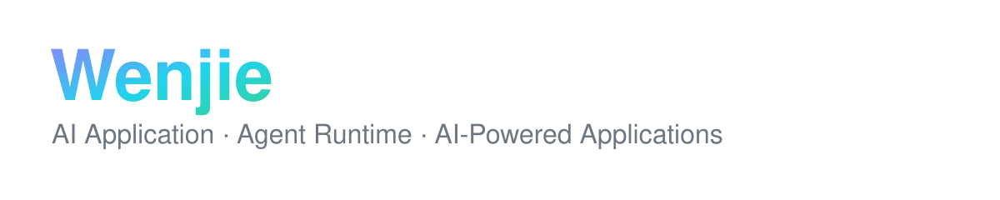

<!-- ============================================================
  GitHub Profile README — 使用方法：
  1. 在 GitHub 上创建与你用户名同名的仓库：liwenjie200543/liwenjie200543
     （Public，勾选 "Add a README"）
  2. 把本文件和 banner.svg 一起提交到该仓库根目录
  3. 搜索下方所有 "TODO" 标记并替换成你的真实信息
============================================================ -->

**`AI Application · Agent Developer`**

<!-- TODO: 联系方式（保留你实际使用的，删掉其余）

-->

---

### 👋 About Me

Hi, I'm **Wenjie**, an AI application and agent developer. I build **AI Agents, Agent Runtimes and AI-powered applications** — and I care about the whole loop that makes an agent actually work in production: a solid runtime &amp; harness, well-engineered context, reliable tool calling, and the observability &amp; evals to prove it.

- 🔭 I'm currently building agent runtimes and AI-powered applications
- 🌱 Active contributor to **Apache Magpie** (Incubating) and 10+ open-source AI projects — **20+ PRs, 6 merged** and counting
- 💬 Ask me about **agents, tool calling &amp; MCP, context engineering, RAG, Text-to-SQL**
- 📫 How to reach me: **TODO**

---

### 🤖 What I'm Working On

| | Area | What it covers |
| --- | --- | --- |
| ⚙️ | **Agent Runtime / Harness Engineering** | The agent loop: planning, execution, sandboxing, approval gates, retries |
| 🧠 | **Context Engineering** | Context assembly &amp; compression, memory, prompt/state management |
| 🔧 | **Tool Calling &amp; MCP** | Tool design &amp; integration, MCP servers, function-calling reliability |
| 📊 | **Agent Observability &amp; Evaluation** | Tracing, eval harnesses, regression testing for agent behavior |
| 🔍 | **RAG / Text-to-SQL** | Retrieval pipelines and natural-language access to data |
| 🚀 | **AI Applications** | Shipping full-stack, LLM-powered products end to end |

---

### 🚀 Open Source

**20+ PRs across the AI agent ecosystem** — framework, runtime security, tool calling, memory, and application layers:

| Project | What it is | My contribution |
| --- | --- | --- |
| 🐦 [**Apache Magpie**](https://github.com/apache/magpie) *(Incubating)* | AI assistant framework that helps open-source maintainers triage issues, mentor contributors and draft docs | Contributor — **5 PRs** ([#1390](https://github.com/apache/magpie/pull/1390) merged): trim the issue/PR-triage skill families, harden stats against untrusted timestamps, add Maven artifact verification to release checks |
| 🧠 [**Agno**](https://github.com/agno-agi/agno) | Full-stack framework for building multi-modal agents | [#10600](https://github.com/agno-agi/agno/pull/10600) — reject forged tool continuations and enforce the approval gate on `/continue`, with regression tests |
| 🌐 [**browser-use**](https://github.com/browser-use/browser-use) | Lets AI agents drive web browsers | [#5919](https://github.com/browser-use/browser-use/pull/5919) — support JSON Schema type arrays (e.g. `["string", "null"]`) in tool schema conversion |
| 💬 [**LibreChat**](https://github.com/LibreChat-AI/LibreChat) | Open-source AI chat app with multi-provider support | [#16409](https://github.com/LibreChat-AI/LibreChat/pull/16409) — generate titles for Open Responses API conversations (shared-service refactor + 12 tests) |
| 💾 [**mem0**](https://github.com/mem0ai/mem0) | Memory layer for AI agents and apps | [#7419](https://github.com/mem0ai/mem0/pull/7419) — LLM provider `base_url` docs master list · [#7431](https://github.com/mem0ai/mem0/pull/7431) — AWS Bedrock Converse response parsing fix |

📈 More contributions

| Project | Contribution |
| --- | --- |
| [vllm](https://github.com/vllm-project/vllm) | [#58816](https://github.com/vllm-project/vllm/pull/58816) — fix the Anthropic messages test for Anthropic SDK 1.x |
| [QwenLM/qwen-code](https://github.com/QwenLM/qwen-code) | [#12697](https://github.com/QwenLM/qwen-code/pull/12697) **merged** — reject http archive URLs with an actionable error · [#12613](https://github.com/QwenLM/qwen-code/pull/12613) — remove dead `REPLACE` mergeStrategy declarations |
| [bytedance/deer-flow](https://github.com/bytedance/deer-flow) | [#5774](https://github.com/bytedance/deer-flow/pull/5774) **merged** — document runtime environment variables |
| [TencentCloud/Octop](https://github.com/TencentCloud/Octop) | [#1049](https://github.com/TencentCloud/Octop/pull/1049) — document backup / mobile / browser-idle env overrides |
| [assistant-ui](https://github.com/assistant-ui/assistant-ui) | [#7983](https://github.com/assistant-ui/assistant-ui/pull/7983) — clarify client refs during SSR in store docs |
| [laya](https://github.com/NandhaKishorM/laya) | 3 merged docs PRs ([#325](https://github.com/NandhaKishorM/laya/pull/325), [#313](https://github.com/NandhaKishorM/laya/pull/313), [#247](https://github.com/NandhaKishorM/laya/pull/247)) — AGENTS.md contribution rules, benchmark-table accuracy |

---

### 📌 Featured Projects

<!-- TODO: 把下面三个卡片换成你自己的仓库（哪怕是课程/练手项目也可以），
     并在 GitHub 个人页 -> "Customize your pins" 里置顶同样的仓库，两边呼应。
     建议至少有一个"自己的 Agent 项目"，让上面的定位有落地证据。 -->

| Project | Description |
| --- | --- |
| 🤖 **[xxx Agent Project](TODO)** | TODO — e.g. an agent runtime / harness I designed, with tool sandboxing &amp; approval gates |
| ⚙️ **[xxx Runtime / Tooling](TODO)** | TODO — e.g. MCP server, eval harness, or context-engineering toolkit |
| 🔍 **[xxx RAG / Text-to-SQL](TODO)** | TODO — e.g. a retrieval or Text-to-SQL demo with measured answer quality |

---

### 🛠️ Toolbox

<!-- TODO: 按真实情况增删 -->

---

<!-- stats: github-readme-stats.vercel.app 公共实例曾不可用，故改用 streak-stats（若日后想换回可还原）

-->

<i>⭐ From [Wenjie](https://github.com/liwenjie200543) — building agents, one tool call at a time.</i>

